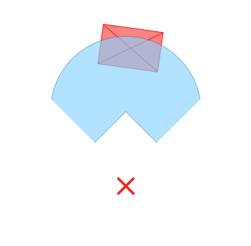
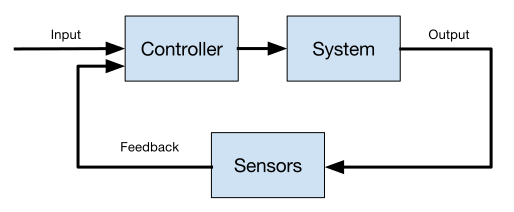
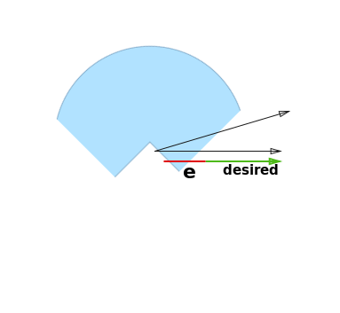
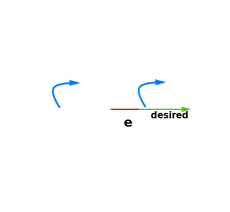
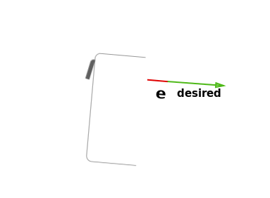

    <h1 class="title-huge">
        Project Report
    </h1>
    <h2 class="title-large">
        BeaverWorks Summer Institute
    </h2>

    <h3>
        August Trollbäck &bull; Max Krieger
    </h3>

    

# Overview

The Beaverworks Summer Institute is a four-week program run by MIT students and faculty.
Its focus is to provide an opportunity for high school students in completing an engineering project,
in this case, programming a small-scale robotic racecar, and to guide the students with lectures
and mentorship. The students worked in teams of 5-6, which shuffled every week until the last.

The program began with a prerequisite of knowledge of Python and ROS (an open-source software
framework for robots), and the on-site curriculum was divided into weeks. Each week, the curriculum
covered an aspect of the robot's necessary driving autonomy and control with lectures and labs, and
the week ended with a challenge related to the material that the teams had to complete. This
culminated in a "Grand Prix" on the final day, where every team from the previous 2 weeks
(totaling 9 teams) competed with their cars on a large racecourse, with the cars driving autonomously.

## Hardware

    

The racecar was equipped with a number of sensors:

### **LiDAR**

- A [Hokuyo UST-10LX](https://www.hokuyo-aut.jp/02sensor/07scanner/ust_10lx_20lx.html)
LiDAR provided distance measurements in a 270 degree FOV (field of view) at
40Hz (40 times per second) [^bw_intro_platform].

- The video below shows LIDAR data recorded (left) and video simultaneously recorded (right)
onboard the racecar as it moves through a track.

    <iframe width="560" height="315" src="https://www.youtube.com/embed/O5Bi8oC5Ess" frameborder="0" allowfullscreen></iframe>

### **Camera**

- The onboard [ZED stereo camera](https://www.stereolabs.com/) recorded high quality video from the left and
right camera, accompanied by a 3D depth map.

### **Inertial Measurement Unit (IMU)**

- The Sparkfun Razor IMU provided measurement in nine degrees of freedom (triple-axis gyroscope, accelerometer,
and magnetometer) [^bw_intro_platform].

### **Processor**

The computer onboard the racecar was an [NVIDIA Jetson TX1](http://www.nvidia.com/object/jetson-tx1-module.html).
The Jetson TX1 is a powerful embedded system with a 64 bit CPU and 256 core GPU [^bw_intro_platform].

# I. **Week 1:** Control

The first week's goal was to introduce the basics of control systems and interpreting LiDAR data.
This required several labs and projects, including implementing an "emergency stop" ROS node, and a
"wall follower" which would align the car with the wall while driving forward.

## The LiDAR & The Emergency Stop Node

The LiDAR sensor provides to the system a polar point cloud of 1081 distances (a 270º FOV centered at the front of the vehicle). From this, one can react to or even map out the immediate environment, allowing for sophisticated navigation and reactive control.

The first task given with the LiDAR was to implement an "emergency stop" node in ROS and Python. The node would observe the LiDAR data, and if it concluded there was an object immediately in front of the vehicle, it would issue a "stop" command to the car to prevent it from colliding with the object.

| To accomplish this, the minimum of a 60º slice of the point cloud immediately in front of the vehicle is taken, and if that minimum is below a threshold, the car's speed is set to 0. `min(points[450:630]) < 0.5`|  |

## Control Systems

A control system is designed to take a system from one state to another. For instance,
if a robot is tasked with following a wall, a control system would be responsible for
guiding the robot from its current distance wall (initial state) to some desired
distance to the wall (final state). Control systems can be divided into two categories:
**open loop** and **closed loop**.

## Open Loop Control Systems

Open loop control systems operate without knowledge of the current output of the system.
Therefore, they are unable to make corrections so that the the current output reaches
the desired output.

## Closed Loop Control Systems

Closed loop control systems make decisions using knowledge of the current output of the system.

    

## PID Control

A common closed loop control system is the PID (proportional-integral-derivative) controller.
It makes use of three parameters in order to accomplish a smooth reduction of a given error term.

$$u = K_p e + K_i \int_0^t e\,dt + K_d \frac{d}{dt} e$$

| By tuning the constants based on the feedback of a PID controller, one can produce a behavior which prevents oscillations (a symptom of "overshooting" a feedback value) and ensures a negligible error value. |  *animation demonstrating the effect of tuning the PID coefficients* [^pidfig] |

This makes PID control applicable to Week 1's challenge, which was to make the car drive while maintaining a perpendicular pose to a wall. In order to accomplish this, the PID controller would send ackermann steering commands to the car, and observe the LiDAR's measured distance from the wall as closed-loop feedback.

The system would work as follows:

| :--: | :--: |
| **The LiDAR observes points from the left or right wall, and uses simple trigonometric functions to compute an error value.** |  |
| **The PID controller uses this error value, as well as the previous error value, to compute a steering angle for the ackermann mechanism.** |  |
| **The ackermann mechanism actuates a steering angle and turns the car closer to its desired value.** |  |

For the sake of time, teams did not apply the integral to their computation. Additionally, many found that calculating the error from a single perpendicular point distance from the LiDAR provided relatively similar results to a trigonometrically computed one. However, this "single-point" method would not always work perfectly, as there are two possible poses the car could be in at a given distance.

# II. **Week 2:** Perception

## Blob detection

To perform blob detection, we used a pipeline of computer vision
operations:

|#| Operation | Output Image |
|-|:--|:--:|
|1|Convert image to HSV colorspace|placeholder|
|2|Color thresholding|placeholder|
|3|Blurring and erosion|placeholder|
|4|Finding contours|placeholder|
|5|Polygon approximation|placeholder|
|6|Find centroid|placeholder|

# III. **Week 3:** Localization and Mapping

## Potential Fields

### **Finding Gradients**

The potential of an obstacle particle is defined as the inverse of
the distance between the car and the obstacle.

$$ U_{\text{obstacle}} = \frac{1}{\| p_{\text{car}} - p_{\text{obstacle}} \|}
= \frac{1}{\sqrt{(x_c - x_o)^2 + (y_c - y_o)^2}} $$

To determine the direction that points down the potential surface, we
find the gradients of the potential with respect to \\(x_c\\) and \\(y_c\\).

$$ \frac{\partial U_{\text{obstacle}}}{\partial x_c} =
\frac{\partial}{\partial x_c} \frac{1}{\sqrt{(x_c - x_o)^2 + (y_c - y_o)^2}} =
- \frac{x_c - x_o}{((x_c - x_o)^2 + (y_c - y_o)^2)^{3/2}}$$

And by symmetry:

$$ \frac{\partial U_{\text{obstacle}}}{\partial y_c} =
\frac{\partial}{\partial y_c} \frac{1}{\sqrt{(x_c - x_o)^2 + (y_c - y_o)^2}} =
- \frac{y_c - y_o}{((x_c - x_o)^2 + (y_c - y_o)^2)^{3/2}}$$

To make an informed driving decision, every gradient from each particle
is summed.

$$ \frac{\partial U_{\text{total}}}{\partial x_c} =
\sum \frac{\partial U_i}{\partial x_c} $$

### **Applying Gradients**

We decided to make the car's steering angle proportional to the potential gradient
with respect to x:

$$\text{steer} = k \frac{\partial U_{\text{total}}}{\partial x_c}$$

For speed, we first created an instantaneous speed update, computed as:

$$s_i = k \Big\| \Big\langle \frac{\partial U_{\text{total}}}{\partial x_c},
\frac{\partial U_{\text{total}}}{\partial y_c} \Big\rangle \Big\|
\text{sign}\Big( \frac{\partial U_{\text{total}}}{\partial y_c}\Big)$$

Instead of feeding this speed update directly to the car, we add it to
a cumulative speed variable that simulates momentum. This speed
is computed with this update rule:

$$\text{let } s_m = \mu s_m + \alpha s_i$$

\\(\mu\\) is responsible for decaying the speed with momentum over time,
comparable to friction. Values of \\(\mu\\) should be close to, but less than
one. Letting \\(\mu = 0.95\\) worked well for us.

\\(\alpha\\) determines how much influence the instanteous speed update should have
in increasing or decreasing the speed with momentum. We picked \\(\alpha = 0.06\\).

The animated figure below shows a 2D plot of the LiDAR data on the left and a
3D surface plot of the potential field on the right. This data was taken from a
run through the obstacle course.

<video controls>
    <source src="http://bwsi-report-media.s3.amazonaws.com/3d_pf_viz.mp4" type="video/mp4">
    Your browser doesn't support HTML5 video.
</video>

**Figure 1:** _(Left)_ LiDAR datapoints mapped to rectangular coordinates.
The car is at \\((0, 0)\\). _(Right)_ a surface plot of the potential field
where height represents the magnitude of the potential.




# IV. **Week 4:** Preparation for the Grand Prix

# References

[^bw_intro_platform]: [Introduction to the RACECAR Platform](https://drive.google.com/file/d/0B6jv7Ea8ZHnNZmZTbUdLWktyLW8/view)
[^pidfig]: [Wikipedia](https://en.wikipedia.org/wiki/PID_controller#/media/File:PID_Compensation_Animated.gif)
