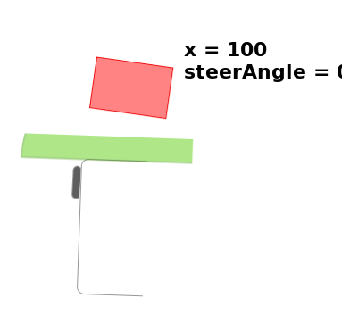
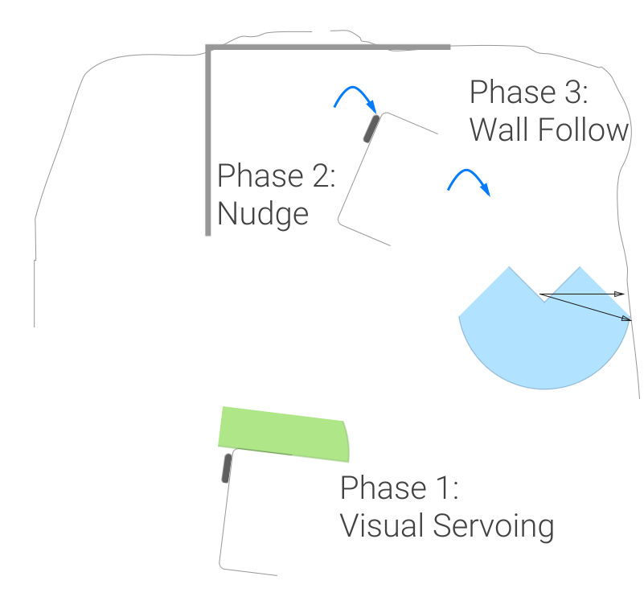
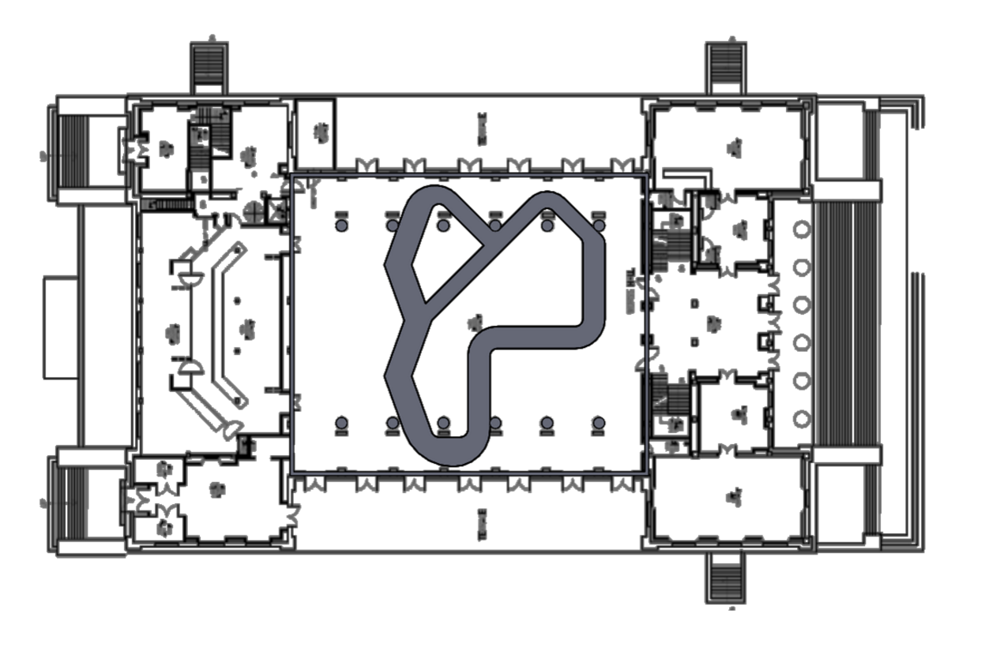
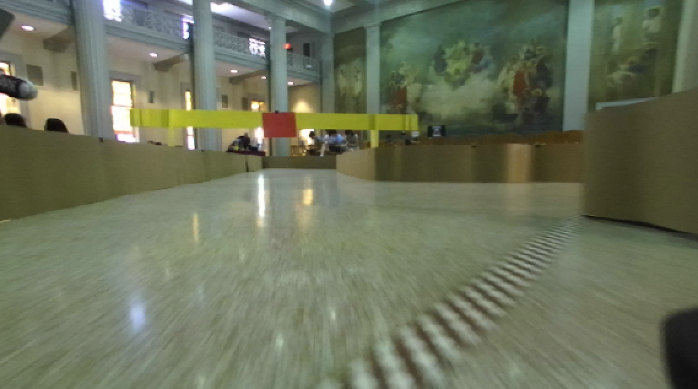

    <h1 class="title-huge">
        Project Report
    </h1>
    <h2 class="title-large">
        BeaverWorks Summer Institute
    </h2>

    <h3>
        August Trollbäck (team 63) &bull; Max Krieger (team 66)
    </h3>

    

# Overview

The Beaverworks Summer Institute is a four-week program run by MIT students and faculty.
Its focus is to provide an opportunity for high school students in completing an engineering project,
in this case, programming a small-scale robotic racecar, and to guide the students with lectures
and mentorship. The students worked in teams of 5-6, which shuffled every week until the last.

The program began with a prerequisite of knowledge of Python and ROS (an open-source software
framework for robots), and the on-site curriculum was divided into weeks. Each week, the curriculum
covered an aspect of the robot's necessary driving autonomy and control with lectures and labs, and
the week ended with a challenge related to the material that the teams had to complete. This
culminated in a "Grand Prix" on the final day, where every team from the previous 2 weeks
(totaling 9 teams) competed with their cars on a large racecourse, with the cars driving autonomously.

## Hardware

    

### **LIDAR**

- A [Hokuyo UST-10LX](https://www.hokuyo-aut.jp/02sensor/07scanner/ust_10lx_20lx.html)
LIDAR provided distance measurements in a 270 degree FOV (field of view) at
40Hz (40 times per second) [^bw_intro_platform].

- The video below shows LIDAR data recorded (left) and video simultaneously recorded (right)
onboard the racecar as it moves through a track.

    <iframe width="560" height="315" src="https://www.youtube.com/embed/O5Bi8oC5Ess" frameborder="0" allowfullscreen></iframe>

### **Camera**

- The onboard [ZED stereo camera](https://www.stereolabs.com/) recorded high quality video from the left and
right camera, accompanied by a 3D depth map.

### **Inertial Measurement Unit (IMU)**

- The Sparkfun Razor IMU provided measurement in nine degrees of freedom (triple-axis gyroscope, accelerometer,
and magnetometer) [^bw_intro_platform].

### **Processor**

- The computer onboard the racecar was an [NVIDIA Jetson TX1](http://www.nvidia.com/object/jetson-tx1-module.html).
- The Jetson TX1 is a powerful embedded system with a 64 bit CPU and 256 core GPU [^bw_intro_platform].

### **Chassis**

- The racecar's chassis was a Traxxas Rally model, capable of speeds up to 40 MPH [^traxxas_rally].

# I. **Week 1:** Control

The first week's goal was to introduce the basics of using ROS and controlling the racecar.
In the beginning of the week, we learned how ROS systems are composed of _nodes_ (a program written
in Python or C++ that does a certain task) and _topics_, which allow nodes to communicate by sending messages.
These concepts were then used to implement an "emergency stop" ROS node, and a
"wall follower" which would align the car parallel to the wall while driving forward.

## The LIDAR & The Emergency Stop Node

The LIDAR sensor provides to the system a polar point cloud of 1081 distances
(in a 270º FOV centered at the front of the vehicle). From this, one can react
to or even map out the immediate environment, allowing for sophisticated
navigation and reactive control.

The first task given using the LIDAR was to implement an "emergency stop"
node in ROS and Python. The node would observe the LIDAR data (by subscribing to the LIDAR sensor topic), and if it
concluded there was an object immediately in front of the vehicle, it would
issue a "stop" command to the car to prevent it from colliding with the object (by publishing to the car's
safety input topic).

| To accomplish this, the minimum of a 60º slice of the point cloud immediately in front of the vehicle is taken, and if that minimum is below a threshold, the car's speed is set to zero. |  |

## Control Systems

In the first week, Kyle Edelberg from JPL taught the group how to autonomously
control robots using _control systems_.

A control system is designed to take a system from one state to another. For instance,
if a robot is tasked with following a wall, a control system would be responsible for
guiding the robot from its current distance wall (initial state) to some desired
distance to the wall (final state).

## Closed Loop Control Systems

Closed loop control systems use feedback from sensors to estimate the system's current
state.

**Above:** a diagram of a closed loop controller.

The system's current state is useful because it can be used to calculate the
error (denoted by \\(e\\)) --- how far from reaching the desired state the system is. 
The controller's goal is to minimize \\(e\\) because the lower the error is, the closer
the system is to the final state.

## PID Control

A common closed loop control system is the PID (proportional-integral-derivative) controller.
It makes use of three constant parameters, \\(K_p\\), \\(K_d\\), and \\(K_i\\), in order to
accomplish a smooth reduction of a given error.

$$u = K_p e + K_i \int_0^t e\,dt + K_d \frac{d}{dt} e$$

The reasoning behind the three terms is as follows:

- The proportional term \\(K_p e\\) is the driving force of the controller ---
  it wants to counteract the error with aggressiveness dependent how large the error is.
- The integral term \\(K_i \int_0^t e\, dt\\) is used to eliminate error that persists
  across the entire time duration, essentially centering the error around zero.
- The derivative term \\(K_d \frac{d}{dt} e\\) is to prevent the controller from overshooting
  across the zero error boundary by penalizing sharp adjustments.

| By tuning the constants based on the feedback of a PID controller, one can produce a behavior which prevents oscillations (a symptom of "overshooting" a feedback value) and approaches a negligible error value. |  *animation demonstrating the effect of tuning the PID coefficients* [^pidfig] |

This makes PID control applicable to Week 1's challenge, which was to make the car
drive while maintaining a perpendicular pose to a wall. In order to accomplish this,
the PID controller would send ackermann steering commands to the car, and observe
the LIDAR's measured distance from the wall as closed-loop feedback.

The system would work as follows:

| :--: | :--: |
| **(1)** The LIDAR observes points from the left or right wall, uses simple trigonometry to estimate the distance from the wall \\(d_\text{estimated}\\), and computes an error value \\(e = d_\text{estimated} - d_\text{desired}\\). |  |
| **(2)** The PID controller uses this error value, as well as the previous error value, to compute a steering angle for the ackermann mechanism. |  |
| **(3)** The ackermann mechanism actuates a steering angle and turns the car closer to its desired value. |  |

For the sake of time, teams did not apply the integral to their computation. Additionally,
many found that calculating the error from a single perpendicular point distance from
the LIDAR provided relatively similar results to a trigonometrically computed one.
However, this "single-point" method would not always work perfectly, as there are multiple
possible poses the car could be in at a given distance.

# II. **Week 2:** Perception

The second week's goal was to make use of the vehicle's onboard GPU and stereo camera to
influence the vehicle's control. This was accomplished by using computer vision algorithms
in the OpenCV library to give the vehicle perceptive detail of any targets in its field of view. Using this perception
to track targets, called "blobs", the teams were tasked with following and ultimately making
a decision based off of the position of these blobs. For ease of detection, the blobs used
were colored pieces of paper.

## Blob detection

To perform blob detection, we used a pipeline of computer vision
operations:

1. The first step was to convert each frame into HSV (hue, saturation, value) color space.
  Normally, digital images are stored in RGB (red, green, blue) color space --- meaning that
  all colors are described as a combination of how red, green, and blue they are. In HSV,
  colors are described as a combination of hue (angle around the color wheel), saturation
  (how "pure" the color is), and value (how vibrant the color is).

2. The blob was filtered out by thresholding the image so that only a certain range of
  colors are kept. To filter out red, for example, colors in the range \\(\text{HSV}(2^\circ, 95\%, 47\%)\\)
  and \\(\text{HSV}(20^\circ, 100\%, 100\%)\\) were kept.

3. The image was eroded to remove noise and smooth edges.

4. The OpenCV `findContours` function was used to find outlines around the filtered blobs.

5. The contour covering the largest area was kept, ignoring contours resulting from noise.

6. The OpenCV `approxPolyDP` was used to approximate a polygon that captures the general shape of the detailed original
  contour. If this polygon does not have four sides (like the colored paper does), it is ignored.

7. The center of the approximated polygon was found so that the blob can be described with a singular
  position.



  

**Above:** an interactive figure showing the output of all the intermediate stages in the computer
vision pipeline. Click a step to view the result of the pipeline at that step.

## Visual Servoing

One challenge leading up to the end of the week was to track and follow a colored
blob using a technique called "visual servoing", which binds the vehicle's vision
directly to its control. By tracking the \\(x\\) position of the blob's centroid,
and scaling it to match the ackermann steering commands, a vehicle can consistently
achieve navigation across an open space to the blob.

    

Additionally, by computing the total area of the blob, one can estimate its
distance to the car. Therefore, when the area exceeds a threshold (in pixel values),
the vehicle will stop in order to prevent from colliding into the blob itself.

## Making the Correct Turn

The week's final challenge was to drive to a colored marker until the vehicle was
inside of a marked box. The vehicle would then turn to the left or right,
depending on the color of the marker, and follow a wall until a finish line [^week2labchallenge].

This resulted in a combination of both the visual servoing developed in the second
week, and a wall-based control developed in the previous week. However, because
the visual servoing was expected to guide the vehicle to a near-perpendicular
pose to the wall, the shift to wall following control would be difficult because
of the large error value that would be computed.

To solve this, we created an intermediary "nudge" phase when the vehicle
entered the box, which turned the vehicle sharp left or right for a fixed amount
of time. Once the nudge phase ended, the wall following algorithm assumed control
of the vehicle, as the vehicle's pose would be near-parallel to the wall.

    

# III. **Week 3:** Localization and Mapping

Week 3's focus was to introduce core concepts of localization and pathfinding for
the vehicle. This involved an introduction to SLAM (Simultaneous Localization And Mapping),
pathfinding algorithms, and advanced blob detection. Although a complete SLAM
implementation would be difficult given the reliability of the vehicle's software & hardware,
the week provided plenty of new insight into making an autonomous vehicle which explored
and recognized objects.

An alternative to SLAM, if the mapping software does indeed prove unreliable, is the
use of reactive pathfinding algorithms. These algorithms do not rely on a map or
localization, and instead directly control the vehicle based on immediate observations
of the surrounding environment. A primitive example of a reactive pathfinding algorithm
would be the wall following algorithm discussed in week 2.

However, a slightly more intelligent approach to reactive pathfinding would work
in any environment regardless of a wall. For that, there is an algorithm which simulates
all obstacles in the LIDAR's point cloud as electric charges, called Potential Field.

## Potential Fields

The Potential Field algorithm observes every point on the LIDAR's point cloud as if
it was a positive charge which follows some sort of inverse law of repulsion as its
distance increases. As the car is tasked with avoiding these charges, its own charge
would be positive as well, so that the car and the obstacles repel each other. In order to provide
a "boost" and keep the car propelled forward, an additional positive charge
is placed directly behind the car's own charge.

If the car was also tasked with navigating towards a goal with a known position
relative to the car, the goal could be represented as a negative charge, attracting
the car to it. In our case, however, this idea was not utilized because in the
exploring space challenge there was no single goal location. While the grand prix
racetrack did have a goal location, it was more straightforward to simply push the
car from behind instead.

### **Finding Gradients**

The potential of an obstacle particle is defined as the inverse of
the distance between the car and the obstacle. Mathematically:

$$ U_{\text{obstacle}} = \frac{1}{\| p_{\text{car}} - p_{\text{obstacle}} \|}
= \frac{1}{\sqrt{(x_c - x_o)^2 + (y_c - y_o)^2}} $$

Where \\(p_\text{car}\ = \langle x_c, y_c \rangle\\) is the car's position and
\\(p_\text{obstacle} = \langle x_o, y_o \rangle \\) is the obstacle's position.

To determine the direction that points down the potential surface (the direction the
car would take to avoid obstacles), we
find the gradients of the potential with respect to \\(x_c\\) and \\(y_c\\) (For brevity,
only the derivation for \\(x_c\\) is shown).

$$ \frac{\partial U_{\text{obstacle}}}{\partial x_c} =
\frac{\partial}{\partial x_c} \frac{1}{\sqrt{(x_c - x_o)^2 + (y_c - y_o)^2}} =
- \frac{x_c - x_o}{((x_c - x_o)^2 + (y_c - y_o)^2)^{3/2}}$$

To make an informed driving decision using the entire environment
, every gradient from each obstacle particle is summed:

$$ \frac{\partial U_{\text{total}}}{\partial x_c} =
\sum \frac{\partial U_i}{\partial x_c} $$

### **Applying Gradients**

Given the direction (and how much) the car is being pushed by the obstacles' potential,
this information has to be translated into a steering angle and a speed in order to send the car
a drive command.

We decided to make the car's steering angle proportional to the potential gradient
with respect to \\(x\\):

$$\text{steer} = k_\text{steer} \frac{\partial U_{\text{total}}}{\partial x_c}$$

For speed, we first created an instantaneous speed update --- proportional to the total repulsion force
felt by the car and in the same direction as its \\(y\\) direction repulsion:

$$s_i = k_\text{speed} \Big\| \Big\langle \frac{\partial U_{\text{total}}}{\partial x_c},
\frac{\partial U_{\text{total}}}{\partial y_c} \Big\rangle \Big\|
\text{sign}\Big( \frac{\partial U_{\text{total}}}{\partial y_c}\Big)$$

Instead of feeding this speed update directly to the car, we apply it to
a cumulative speed variable that simulates momentum. The purpose of
simulating momentum is twofold: **(1)** it smooths the car's speed over time
and **(2)** lets the car build up speed to overcome local minima (valleys
in the surface of the potential field where the car can get stuck). This speed
is computed with the following update rule:

<table>
    <tbody>
        <tr>
            <td width="30%">
$$\text{let } s_m = \mu s_m + \alpha s_i$$
            </td>
            <td>
\(\mu\) is responsible for decaying the speed with momentum over time,
comparable to friction. Values of \(\mu\) should be close to, but less than
one. Letting \(\mu = 0.95\) worked well for us.

 
 

\(\alpha\) determines how much influence the instanteous speed update should have
in increasing or decreasing the speed with momentum. We picked \(\alpha = 0.06\).
            </td>
        </tr>
    </tbody>
</table>
 

Tuning \\(k_\text{steer}\\), \\(k_\text{speed}\\), \\(\mu\\), \\(\alpha\\) depended
on the context in which the racecar was moving. In the context of exploring a space
while avoiding obstacles, it was appropriate to make the car be nimble --- high
steering reaction and low potential pushing it forward. In the context of racing
through a track, however, the car was tuned to be more aggressive --- less steering
reaction and more potential propelling it forward.

The interactive figure below shows a 2D plot of the LIDAR data on the left and a
3D surface plot of the potential field on the right. This data was taken from a
run through an obstacle course.

    

# IV. **Week 4:** Preparation for the Grand Prix

For the final week, every team was tasked with adapting their existing algorithms and procedures to a large racecourse, where every car would complete on the final day. The course contained multiple turns, and a forked path with shortcut, which would allow cars through when a colored paper signal was green. If the paper signal was red, the cars had to turn to the right, as the shortcut would be closed.

 
<b>Above:</b> illustration of the final racecourse [^finalcourse]

## Navigation

For many teams, the course itself would not be the major issue. A well-optimized potential field algorithm would respond to the contours of the course's walls smoothly without collision. Thusly, most teams succeeded with an adapted potential field algorithm for general purpose navigation. For others, an adapted wall following algorithm could perform equally well on the time trials, as long as it could respond to turns without losing sight of the wall or overshooting.

That being said, our group's (team 66) own potential field algorithm would still oscillate periodically if a turn was particularly large, as it would constantly overshoot in attempts to right itself. To solve this, we used a paradigm from the PID algorithm: the derivative. By adding some coefficient times the previous computed \\(y\\) vector, oscillations would be miniscule if not having disappeared completely. This allows for much higher quality course following. However, one flaw to note is that encountering sharp, near 90º turn would simply result in a collision with the wall. This flaw would materialize later in the grand prix.

## The Fork

The forked path in the course would prove to be challenging to work with. Not only were lighting conditions in the building subpar for accurate detection of the signal, but incorrectly deciding when to turn to the right, if the signal was indeed red, would result in a wall collision.

    
     
    <b>Above:</b> the forked path of the course with a red signal above the shortcut corridor.
    The vehicle had to decide whether to turn left or right.

Many teams took multiple steps to alleviate these challenges. As the detection of the red blob (signal) would not be constant, a decision to turn would be reactive and informed. Some teams used a rolling average of the binary presence of the red blob, and if the average was high enough, a turn would take place.

For the turn itself, the area of the blob was enough to approximate the proximity of the right corridor. Whether the area threshold was correct for an optimal turn, however, was a separate issue. Once the threshold was large enough, and the rolling average confirmed that it was a persistent red blob, a large, virtual positive charge was inserted to the left of the car in order to force it to turn to the right. As soon as the red blob disappeared from the car's field of view, the charge would be removed so the car could continue.

Likewise, if the blob was green, to prevent the car from veering to the right after seeing an open corridor, a virtual positive charge would be placed to the right to keep the car on a relatively straight course.

**Max**:

> Unfortunately due to the lack of time in testing our vision, the car was unable to decide to turn to the right during the grand prix. This was due to a mistuned threshold of the size of the red blob, causing the car to steer either prematurely or too late to the right. However, when the signal was green, the car was able to respond correctly and drive straight through the shortcut.

**August**:

> At the end of the day before the grand prix, we were unable to consistently detect the red/green blobs. However, when it was our turn
> to race on the morning of the grand prix, we were pleasantly surprised to find that the detection worked in all three time trials.
> Presumably our color ranges were calibrated in the morning the day before and became ineffective in the afternoon light.

# Reflection

  Working on this project meant facing essentially any challenge which came across our, or our racecar's path. Working with an unfamiliar, unpredictable system provided hurdles which only tightened deadlines. On top of that, accomplishing the feat of developing a working robot while working in a team of 5 meant there was no collective conscious. Tasks had to be split, issues raised loudly, and focus had to be able to spin on a dime.

  The obvious outcome of this situation is that much will be learned about teamwork. Tackling a complex engineering challenge as a team is challenging, but exactly how real-world engineering works. The added dimension of competition meant better ideas came out of more people, and most were still shared between teams.

# The Future

  The engineering of autonomous vehicles is obviously burgeoning, and will most likely disrupt the transportation market within the next decade. It's a fantastic opportunity to experience the development of such machines firsthand, and to learn from so many speakers in the field of robotics.

# References

[^bw_intro_platform]: [Introduction to the RACECAR Platform](https://drive.google.com/file/d/0B6jv7Ea8ZHnNZmZTbUdLWktyLW8/view)
[^traxxas_rally]: [Traxxas Rally Product Page](https://traxxas.com/products/models/electric/74076rally)
[^pidfig]: [Wikimedia Commons](https://en.wikipedia.org/wiki/PID_controller#/media/File:PID_Compensation_Animated.gif)
[^week2labchallenge]: [Friday Challenge: Make the correct turn](https://docs.google.com/document/d/1tuRuW7xBLRTJqUfpCnNMH-ktWLft_vGdvnr7RT1cgk8/edit)
[^finalcourse]: [Last Week Schedule](https://docs.google.com/document/d/1WoPfoQuD2ArihMnsGA0yWzlRxa1iL3IyfJUgsMoGKYA/edit)


